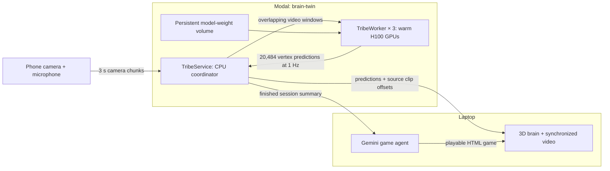

# Brain Twin (brain2game)

Point your phone at the world; a Modal H100 runs Meta's TRIBE v2 brain encoder on what it sees and
hears; the laptop paints what an *average human brain* would be doing about 15 s later on a 3D cortex;
press Finish and a Gemini agent writes you a browser game that exercises the least-driven system.

Honest framing: TRIBE v2 predicts the group-average fMRI response to a stimulus. This is a brain
twin / simulator, not a brain reader. All three of TRIBE's pathways run: video (V-JEPA2), audio
(w2v-bert) and text (speech transcribed by a resident faster-whisper large-v3-turbo, then Llama 3.2 3B).
Set `TEXT_ON=0` in the Modal environment to go back to audio + video only.

Design and API contracts: [CONTRACTS.md](CONTRACTS.md).

## Modal architecture

The live brain view depends on a distributed multimodal inference pipeline. The main engineering
challenge is keeping several large models resident, processing overlapping video windows fast enough
to follow a live camera, and preserving the relationship between each prediction and its source footage.
Modal runs the CPU coordinator and a pool of GPU workers; the laptop handles visualization and game generation.



**The CPU service owns timing and coordination.** `TribeService` runs in one container with 4 CPUs
and 8 GiB of memory. It serves the phone capture page, receives MP4/WebM uploads, orders chunks by
sequence number, and builds contiguous windows covering roughly the latest 20 seconds. Uploads can
arrive out of order, and inference jobs can finish out of order. Each session allows up to `WORKERS`
windows in flight; when all slots are occupied, it coalesces new arrivals into the latest pending
window instead of building a growing queue of stale work.

**Each GPU worker runs the full model stack.** A `TribeWorker` has one H100, 8 CPUs and 32 GiB of
host memory. Its independent resident models process three pathways before the TRIBE prediction head
produces a cortical response:

| Pathway | Processing |
| --- | --- |
| Video | V-JEPA2 extracts visual features from sampled frames. |
| Audio | w2v-BERT extracts acoustic features. |
| Speech/text | faster-whisper large-v3-turbo transcribes speech; Llama 3.2 3B extracts text features. |

Making that stack usable live required changes below the HTTP layer:

- **Container and model setup:** the image combines Python 3.11, pinned PyTorch/vision/audio versions,
  TRIBE v2, ffmpeg and faster-whisper. CUDA library paths are set explicitly for the speech runtime.
  The `huggingface-secret` supplies model access, while `brain-twin-cache` persists downloaded weights
  across container replacements. Each worker loads its own models and performs two warm-up passes.
- **Video inference optimization:** [fast_video.py](modal_app/fast_video.py) keeps V-JEPA2 resident,
  decodes each video once with ffmpeg, samples at 16 fps, and uses GPU preprocessing and bf16 inference.
  A preprocessing equivalence check compares the optimized path with the model's Hugging Face processor.
- **Speech and feature caching:** [fast_text.py](modal_app/fast_text.py) replaces repeated transcription
  subprocesses with a resident Whisper model and keeps the text/audio extractors loaded between calls.
  Worker-local feature caches must remain consistent with their in-memory indexes.
- **Media integrity and synchronization:** uploads are remuxed into a consistent audio/video track order.
  Overflowing frame durations are repaired before inference; invalid media is rejected. Predictions keep
  their exact source clip offsets, so the video preview follows the same footage used by the model.
  The first accepted prediction for a second is retained, and the last two seconds of ordinary windows
  are held back until more context arrives.
- **Finishing without losing work:** Finish waits for dispatched windows, runs a final pass without the
  trailing drop, and caches the summary. The laptop polls this background operation and reconnects after
  transport errors. Repeated finish requests share the same work.

The deploy-time settings are baked into the container environment:

| Setting | Default | Purpose |
| --- | --- | --- |
| `WORKERS` | `3` | Number of GPU workers kept warm; also the per-session concurrency limit. |
| `GPU` | `H100` | GPU type allocated to each worker. |
| `WINDOW_S` | `20` | Target length of the trailing inference window. |
| `TEXT_ON` | `1` | Enable speech transcription and the text pathway. |

Changing these settings requires a deploy. Model weights persist on the volume; live session state,
predictions and uploaded footage live in the API container and expire when it is replaced. Startup
therefore includes model loading and warm-up, and a fresh viewer session is needed after an API restart.
`GET /` reports deployment configuration; `/workers` reports one worker's warm-up and feature statistics;
`/session/{sid}/status` exposes the backlog, prediction progress, inference timing and errors.

## Gemini game agent

The agent in [app/agent.py](app/agent.py) turns a completed brain-response summary into a playable game.
It runs on the laptop through the Gemini API. Its inputs are the current session's system/region
statistics, the reference baseline, and the functional-system definitions in [app/regions.py](app/regions.py).
Previous games are saved for inspection but are not included in the planning prompt.

1. **Rank the eligible systems.** Python compares nine game-target systems with the reference clips.
   With a baseline, the score combines the standardized difference in mean activity with the difference
   in active-time fraction: `(mean - baseline_mean) / baseline_std + (frac_active - baseline_frac_active)`.
   A missing or zero standard deviation uses `1`; without a baseline, the score is `mean + frac_active`.
   Lower scores indicate less predicted activity relative to the comparison. Language and default mode
   remain contextual information rather than game targets.
2. **Plan with Gemini.** The analysis call receives those scores, region summaries and system-specific
   game hints. A JSON schema requires a target, a short explanation, supporting evidence and a concrete
   game concept, mechanic and control scheme. The prompt normally favors the first-ranked system and
   asks for a justification if the model chooses another. The application attaches the actual numerical
   evidence to the returned plan.
3. **Generate the game.** A separate call turns the plan into a complete HTML document with inline CSS
   and JavaScript. The contract requires procedural canvas graphics, a 60-second round, scoring, a
   visible explanation of the target, keyboard or mouse controls, and no external assets or requests.
   The game also exposes `window.startDemo()` for automated playback and posts its final score to the viewer.
4. **Run and inspect it.** Playwright opens the generated file in headless Chromium, exercises input and
   demo playback, captures a screenshot, and checks for runtime errors, missing canvas/demo support and
   external requests. This is a browser smoke test of the generated code.
5. **Repair or recover.** When checks find problems, Gemini receives the broken HTML and the specific
   diagnostics for one repair pass, followed by another browser check. Analysis and generation also have
   bounded retries. If generation is unavailable or the game remains unusable, the pipeline can serve the
   built-in motion game and records that substitution in the plan and logs.

Model selection supports separate roles: by default the agent discovers and probes available Gemini
models, preferring Flash for analysis and Pro for code generation. `GEMINI_MODEL_FAST` and
`GEMINI_MODEL_CODE` in `.env` override those choices. The demo runs described below use
`gemini-3.8-flash` for code generation to shorten the wait.

The viewer polls the laptop's background job and displays its progress log. Each completed run saves
`app/games/<id>.html` and a JSON record containing the plan, model names, timings, browser-check results,
repair details and fallback status. Target selection, generated code and execution failures can therefore
be inspected separately.

## One-time setup

```
# .env (git-ignored)
GEMINI_API_KEY=...
MODAL_BASE_URL=https://recozers--brain-twin-tribeservice-web.modal.run

pip install httpx google-genai python-dotenv playwright nilearn
python3 -m playwright install chromium
brew install ffmpeg
```

Modal: `modal token` already set up; volume `brain-twin-cache` holds the weights (seeded once with
`modal run scripts/seed_volume.py`); secret `huggingface-secret` supplies the HF token.

## Run

```
# 1. backend (once; keeps WORKERS H100s + one small API container warm until `modal app stop brain-twin`)
WORKERS=3 GPU=H100 WINDOW_S=20 modal deploy modal_app/tribe_service.py   # knobs: WORKERS, GPU, WINDOW_S, TEXT_ON
#   measured 2026-09-19: H200 = same speed as H100 (video stage is compute-bound); 12 s windows cut lag ~5 s but
#   agree with a 20 s run at r=0.77 vs a 0.87 noise floor, so 20 s is the accuracy choice.
#   If GPU workers stay pending after a redeploy, `modal app stop brain-twin` first: old workers hold the slots.

# 2. laptop app
uvicorn app.server:app --port 8001        # then open http://localhost:8001  (8000 is taken by an old http.server on this laptop)

#    stage fallback with no backend at all: http://localhost:8001/?mock=1
# 3. phone: scan the QR on the viewer (opens <MODAL_BASE_URL>/capture?sid=...), press Start
#    or, without a phone, replay a clip through the real pipeline:
python3 scripts/fake_phone.py samples/mcp_video-1349.MOV --sid <sid shown in the viewer>
```

## Sample clips and baseline

```
python3 scripts/predict_file.py samples/*.mov      # -> samples/<name>.npz/.json + samples/baseline.json
python3 scripts/build_assets.py && python3 scripts/build_hires.py   # rebuild viewer meshes/atlas after a fresh clone (binaries are git-ignored)
```

The baseline (per-system stats averaged over the samples) is what the agent compares a session
against when deciding which system is under-driven.

## Layout

- `modal_app/tribe_service.py` — Modal app: CPU session coordinator, GPU worker pool, rolling ~20 s windows, /predict, phone page
- `modal_app/fast_video.py` — speed patches for neuralset's V-JEPA2 extractor (resident model, bf16, ffmpeg decode)
- `modal_app/fast_text.py` — resident faster-whisper in place of the whisperx subprocess; keeps Llama and w2v-bert loaded across calls; per-modality timing
- `modal_app/capture.html` — phone capture page (MediaRecorder rotated every 3 s)
- `app/server.py`, `app/agent.py` — laptop FastAPI + Gemini game agent; `app/static/` — three.js viewer (`brain.js` = full-res fsaverage renderer with pial/inflated morph and bloom, press `i` or the Inflate button; add `?hires=0` to fall back to the fsaverage5 mesh)
- `app/regions.py` — functional systems table shared by everything
- `scripts/` — asset builder, volume seeding, sample prediction, fake phone

## Demo-day runbook

1. Backend warm? `curl -s $MODAL_BASE_URL/` shows the version and worker count; `curl -s $MODAL_BASE_URL/workers` returns one worker's warm-up stats. If the app was stopped: `WORKERS=3 GPU=H100 WINDOW_S=20 modal deploy modal_app/tribe_service.py` and wait ~3 min for the workers to warm up.
2. `uvicorn app.server:app --port 8001` from the repo root, open http://localhost:8001 on the laptop (a fresh `sid` is generated; the QR encodes it).
3. Phone: scan the QR, allow camera + mic, press **Start streaming**, keep the app in the foreground. Point it at faces, motion and speech; the brain lags ~15-20 s.
   The muted camera preview beneath the system stats follows the displayed brain time, showing the footage
   used for that prediction. It pauses with the brain and follows catch-up playback across clip boundaries.
4. **Finish** → the agent log streams into the page (~45 s with `GEMINI_MODEL_CODE=gemini-3.8-flash`; ~3 min with the pro model) → the game takes over the screen, brain in the corner. **Back to brain** returns.
   Finishing polls a cached background result and reports inference progress; it tolerates slow inference
   and connection retries for up to 10 minutes. Uploaded clips have their track order normalized and
   overflowing frame durations repaired before either inference or preview playback.

Fallbacks, in order:
- No phone / bad wifi: `python3 scripts/fake_phone.py <clip> --sid <sid shown on the viewer>` streams a clip through the real pipeline.
- No backend: `http://localhost:8001/?mock=1` (synthetic activity, mock Finish, built-in game).
- Gemini down: the agent falls back to `app/games/_fallback_motion.html` automatically. Pre-generated real games are kept in `app/games/` and served at `/game/<id>` (e.g. `20260919-114240-a18c` coherent-dot motion, `20260919-113855-6be8` rule-shift cards).

## License notes

The code in this repo was written in a one-day hackathon and is provided as-is. It depends on Meta's
[TRIBE v2](https://github.com/facebookresearch/tribev2) model and weights, which are released under
**CC-BY-NC 4.0 (non-commercial)**; anything you build on top inherits that restriction for the model
part. The fsaverage surfaces come from FreeSurfer via nilearn; the Glasser parcellation is the
HCP-MMP1.0 atlas projected to fsaverage.
